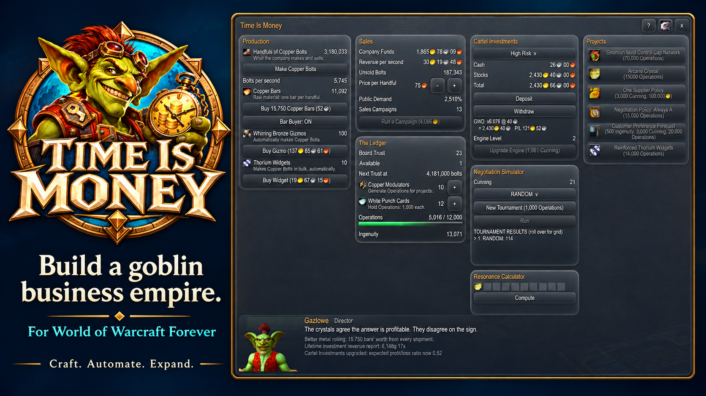

# Time Is Money

> A goblin company teaches an enchanted ledger to make bolts. The ledger gets very good at its job.

A single-player World of Warcraft: Forever addon mini-game based on Universal
Paperclips, presented as goblin industrial satire in Liquid Glass. Preserve three
phases, all 96 projects, recovery, prestige choices and terminal liquidation.
Company funds and materials are entirely simulated.

**Status: 0.1.0, the first release ([changelog](CHANGELOG.md)).** The whole game
runs in the ledger window, with saves, settings and the animated Director.

## Playing

1. Install the TimeIsMoney folder into the Forever client's Interface\AddOns folder
   (from CurseForge, or the release archive) and restart the game.
2. Type **/tim start** to found your company: the ledger and the help page open.
   After that, **/tim** opens or closes the ledger.
3. Progress is saved when you log out or /reload. A crash or forced close can lose
   progress since the last save. Nothing is produced while you are offline.

Commands: /tim start, /tim (open or close the ledger; the company keeps working while it is
closed), /tim pause, /tim settings, /tim reports, /tim minimap, /tim help, /tim status.

## Developing

- [Implementation spec](docs/plan/Time-Is-Money-Implementation-Spec.md) and
  [creative brief](docs/plan/Time-Is-Money-Original-Plan.md); original concepts in [storyboards](docs/storyboard).
- [Roadmap and issue catalog](docs/BACKLOG.md).
- [Pure-Lua simulation](docs/reference/WORKSHOP.md), its [client host adapter](docs/HOST.md) and [saved games](docs/SAVES.md).
- [Releases](docs/RELEASE.md), the [release acceptance matrix](docs/ACCEPTANCE.md) and [project traceability](docs/reference/PROJECTS.md).
- [Animated goblin Director](docs/MODELS.md), using AltStable's roster pet renderer.
- [References and evidence](docs/REFERENCES.md).
- [Agent instructions](CLAUDE.md), also reached through [AGENTS.md](AGENTS.md).

Target: Forever Interface 16001; API evidence build 1.60.1.70205; offline Lua 5.1.
Validate with **pwsh tests/run.ps1**; deploy with **pwsh Tools/deploy.ps1**.
Deployment defaults to the Forever _classic_beta_ AddOns folder. Restart after
first installing, enable script errors, then run /tim status.

M0 setup gates are complete: original documents, milestone backlog, local checkout,
docs MCP configuration, Windows validation and recorded client command responses.
See [M0 status](docs/M0-STATUS.md). The original design docs and both storyboards are
committed byte-for-byte; docs/originals.json records their sizes and Git blob hashes.
CI checks the original bytes, Lua bootstrap, Windows test/deploy tooling and package.

GitHub issues are the work queue; changes use PRs. The owner runs reviews and merges.
Original code is MIT; see Credits & Legal below for the Universal Paperclips notice.

## Credits & Legal

Frank Lantz, Chair of the NYU Game Center, created *Universal Paperclips*. His site
is [franklantz.net](https://www.franklantz.net/).

Bennett Foddy is credited in the original game for its combat programming, which
this addon's battles reproduce.

This is an unofficial, non-commercial fan project. Its core logic and math are
derived from the original game at
[decisionproblem.com](https://www.decisionproblem.com/paperclips/). Please support
the creator by playing or purchasing the official version.

The addon's in-game help credits the original and links to it. See
[LICENSE](LICENSE) for the third-party notice: the MIT License covers this addon's
original code, not the Universal Paperclips IP, narrative text or game logic, and
not Blizzard's assets.
